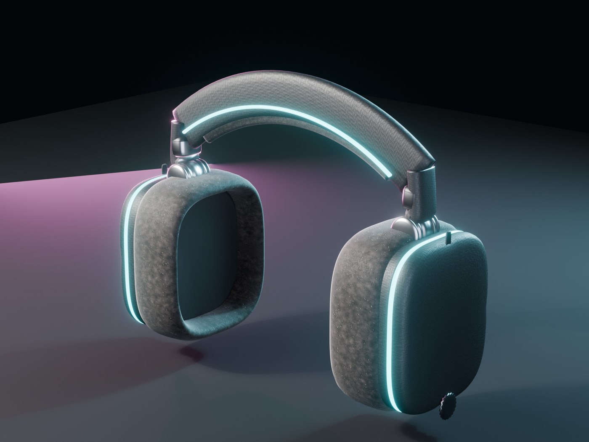
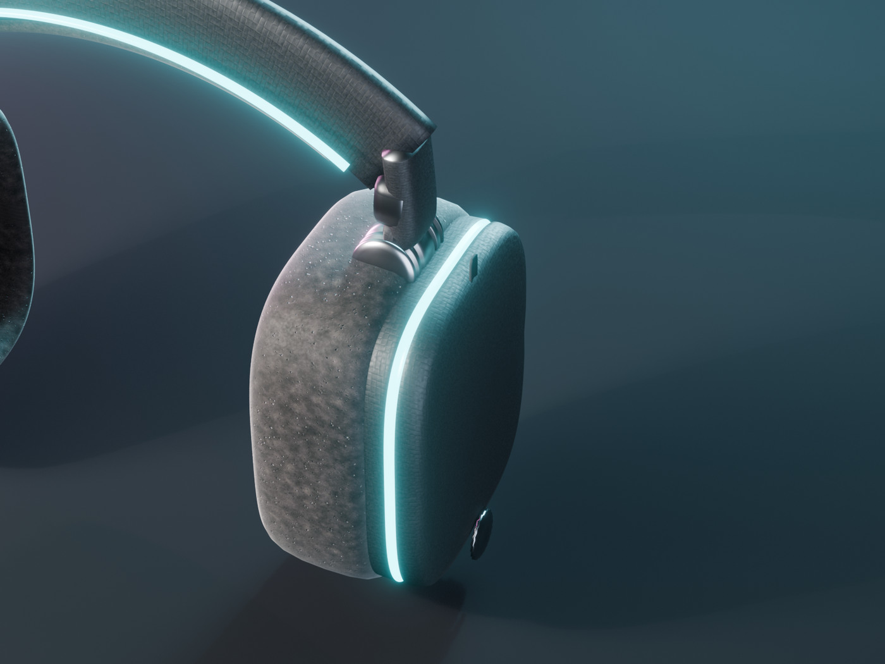
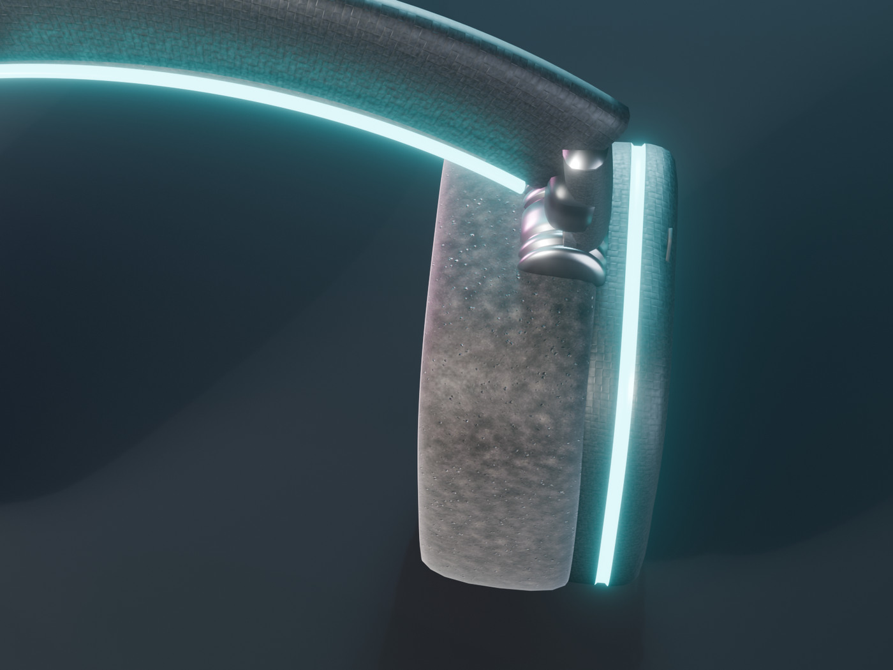
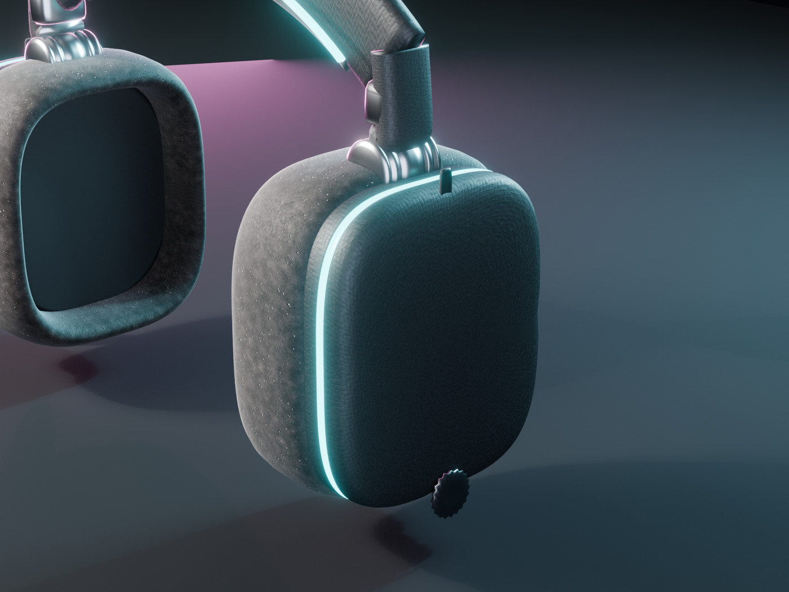
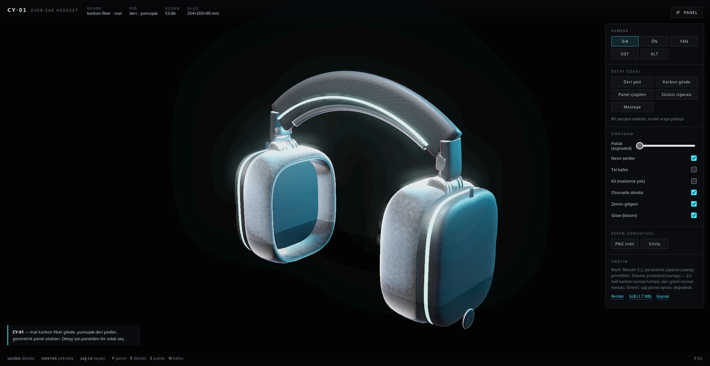
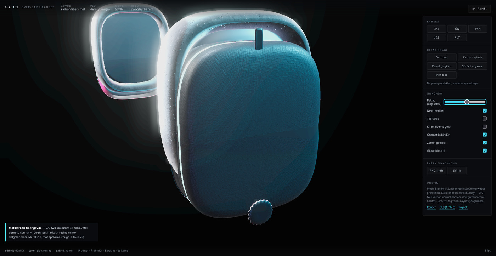

# CY·01 — Cyberpunk Kulaklık (prosedürel 3B model)

Mat karbon fiber gövdeli, yumuşak deri pedli bir **over-ear** kulaklığın tarayıcıda
döndürülebilir 3B modeli. Model Blender'da **parametrik olarak kod ile** üretildi
(elle modelleme yok), dokular numpy ile prosedürel olarak hesaplandı, önizleme
three.js ile GitHub Pages üzerinde çalışıyor.

**Önizleme:** `https://<kullanıcı>.github.io/cyberpunk-headphones/`

## Görseller

| | |
|---|---|
|  |  |
|  |  |
|  |  |


## İstenen özellikler ve karşılıkları

| İstenen | Nasıl yapıldı |
|---|---|
| Keskin ve **simetrik** detay | Sağ yarı modellenip X ekseninde aynalandı; `check_symmetry()` her derlemede 25 408 köşe çiftini birebir karşılaştırır. |
| **Yumuşak deri** kulak pedi | Sünger profili şişkin bir süpürme (sweep); prosedürel deri greni: geniş mottle + kırışık ağı + gözenek göçüşü → 512² normal haritası, rough 0.52–0.92, hafif sheen. |
| **Mat karbon fiber** dış gövde | 2/2 twill dokuma: 32 çözgü/atkı demeti, üst üste binen demet yükseklik alanı → 1024² normal + roughness haritası. Metallic 0, mat reçine. |
| **Net panel çizgileri** | Boya değil geometri: 45° pahlı duvar + düz tabanlı oluklar (çevresel hat + kubbe üzerinde 4 radyal çizgi), ayrı koyu malzeme (`Seam`). |
| GitHub'dan **önizlenebilir** | Statik site + Draco sıkıştırılmış GLB; GitHub Pages ile servis edilir, harici CDN yok. |

Ek cyberpunk detayları: neon ışık kılavuzu (gövdede LED halkası + band şeritleri +
menteşe pivot düğmesi), torna edilmiş menteşe, işlenmiş sürücü ızgarası, USB-C
yuvası ve tırtıklı ses kadranı.

## Ölçüler ve teknik veri

- Gövde: **254 × 203 × 99 mm** (genişlik × yükseklik × derinlik)
- 53 804 üçgen · 15 nesne · 7 malzeme (CarbonFiber, Leather, Metal, GrilleMetal, Seam, Neon, Rubber)
- GLB: **~1.7 MB** (Draco ile sıkıştırılmış, dokular gömülü)
- Dokular: prosedürel, 8 dosya / ~1.5 MB (karbon 1024², deri 512², roughness 256²)

## Dosya düzeni

```
build/gen_textures.py   prosedürel doku üretimi (numpy + PIL)      -> assets/textures/
build/build_model.py    Blender mesh + malzeme + GLB + render      -> model/, docs/renders/
build/dump_mesh.py      mesh'i numpy dizisine döker (QA için)
build/qa_render.py      GPU'suz ASCII/zbuffer QA render'ı (silüet, panel çizgileri)
build/look.py           render istatistikleri + ASCII önizleme
build/browser_test.sh   gerçek tarayıcıda uçtan uca öz-test (?selftest=1)
build/browser_shots.sh  gerçek tarayıcıdan ekran görüntüleri
src/viewer.js           three.js izleyici (kamera, malzeme, patlatma, bloom)
src/selftest.js         tarayıcı içi öz-test koşucusu
index.html              önizleme sitesi (GitHub Pages kök)
model/*.glb             yayınlanan model
docs/renders/           Blender render'ları + tarayıcı ekran görüntüleri
```

## Yeniden üretme

```bash
python3 build/gen_textures.py                       # dokular (~15 sn)
blender -b --python build/build_model.py            # mesh + GLB + render'lar (~2 dk)
node_modules/.bin/esbuild src/viewer.js --bundle --format=esm --minify \
  --outfile=assets/js/viewer.bundle.js              # izleyici paketi
python3 -m http.server 8123                         # yerel önizleme
bash build/browser_test.sh                          # gerçek tarayıcı öz-testi
```

Gereksinimler: Blender 5.2 (EEVEE), Python 3 (numpy, Pillow), Node 20+ (three, esbuild).

## İzleyici özellikleri

- Kamera ön ayarları: 3/4, ön, yan, üst, alt (her biri modele göre sıkı kadraj)
- Detay odağı: deri ped, karbon gövde, panel çizgileri, sürücü ızgarası, menteşe
- Patlatılmış görünüm (montaj gruplarına göre, %0–100), tel kafes, kil (clay) modu
- Neon ve bloom anahtarları, zemin gölgesi, otomatik döndürme
- PNG indirme; klavye: `P` panel, `R` döndür, `E` patlat, `W` kafes
- Yerel varlıklar: three.js paketlenmiş, Draco çözücü repoda — CDN çağrısı yok

## Doğrulama

- **Simetri:** `SYMMETRY {"ok": true}` — her derlemede köşe köşe kontrol.
- **Malzeme geometrisi:** `qa_render.py` ile z-buffer + silüet çizimi (GPU'suz).
- **Tarayıcı:** `browser_test.sh` gerçek bir tarayıcıda 30+ adımı çalıştırır
  (model yükleme, 5 kamera ön ayarı, 5 odak, patlatma, 6 anahtar, kadraj
  taşma kontrolü) ve JSON raporu toplar. Son koşu: `ok: true`, `errors: []`.

## Lisans

Model, dokular ve kod: MIT. Malzemeler özgün; üçüncü taraf marka taklidi yoktur.
